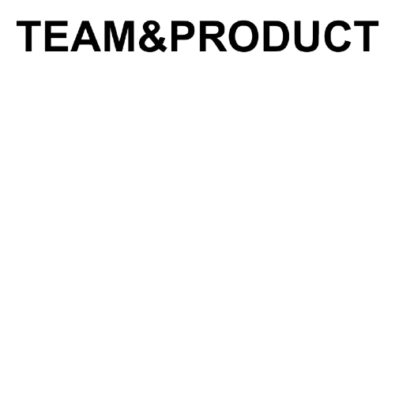
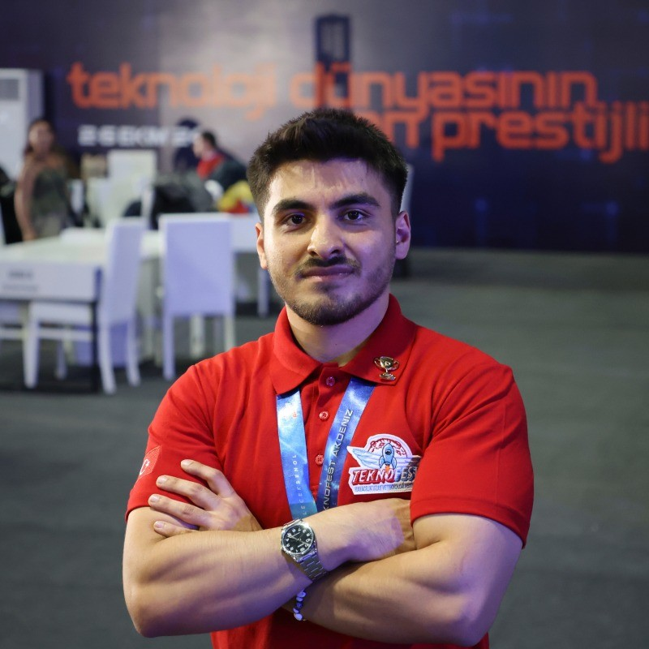
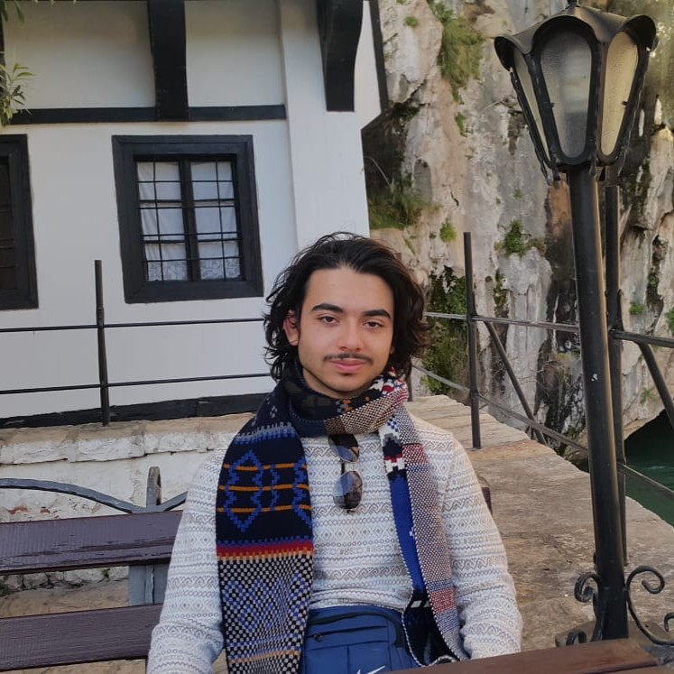
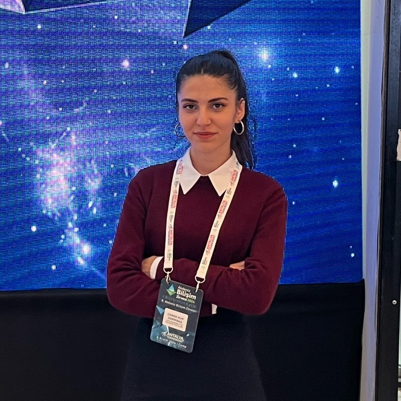
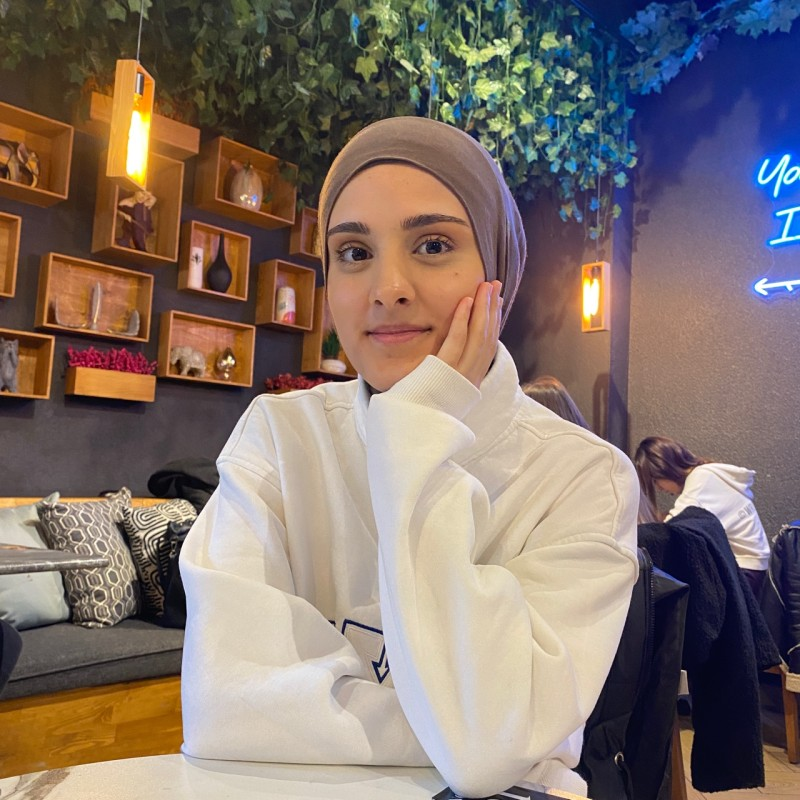
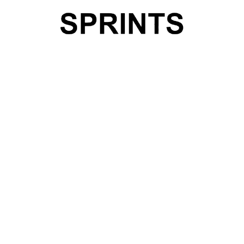
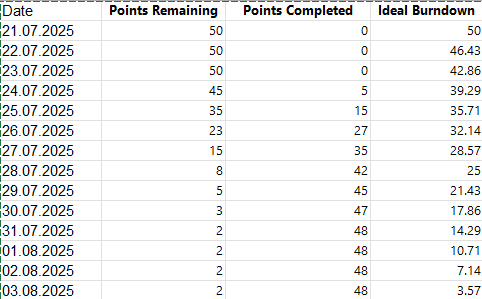

# Foodlens Project - Smart Nutrition Analysis Platform




## **Team Name: Team FoodLens - T199**

---

## Team Members

### **Team Roles & Responsibilities**

- **Scrum Master**: Facilitates sprint processes, daily scrum coordination, and removes obstacles
- **Product Owner**: Defines product vision, manages user requirements, and prioritizes backlog
- **Development Team**: Responsible for software development, testing, and technical implementation

<table>
  <tr>
    <th></th>
    <th>Name</th>
    <th>Role</th>
    <th>Social Media</th>
  </tr>
  <tr>
    <td></td>
    <td>Ali Rıza Ercan</td>
    <td>Scrum Master</td>
    <td>
      <a href="https://github.com/alirizaercan" target="_blank"></a>
      <a href="https://www.linkedin.com/in/alirizaercann/" target="_blank"></a>
      <a href="#" target="_blank"></a>
    </td>
  </tr>
  <tr>
    <td></td>
    <td>Kutay Yıldırım</td>
    <td>Product Owner</td>
    <td>
      <a href="#" target="_blank"></a>
      <a href="https://www.linkedin.com/in/kutayyildirim/" target="_blank"></a>
      <a href="#" target="_blank"></a>
    </td>
  </tr>
  <tr>
    <td></td>
    <td>Aybüke Bozkurt</td>
    <td>Development Team</td>
    <td>
      <a href="#" target="_blank"></a>
      <a href="https://www.linkedin.com/in/aybüke-bozkurt/" target="_blank"></a>
      <a href="#" target="_blank"></a>
    </td>
  </tr>
  <tr>
    <td></td>
    <td>Ceren Nur Demirbaş</td>
    <td>Development Team</td>
    <td>
      <a href="#" target="_blank"></a>
      <a href="https://www.linkedin.com/in/ceren-nur-demirbaş-4b8563228/" target="_blank"></a>
      <a href="#" target="_blank"></a>
    </td>
  </tr>
  <tr>
    <td></td>
    <td>Evin Yıldırım</td>
    <td>Development Team</td>
    <td>
      <a href="#" target="_blank"></a>
      <a href="https://www.linkedin.com/in/evin-yıldırım-3633161b7/" target="_blank"></a>
      <a href="#" target="_blank"></a>
    </td>
  </tr>
</table>

---

## Product Name
**FoodLens** - Smart Nutrition Analysis Platform

## Product Description

**FoodLens** is a smart nutrition analysis platform that analyzes content by photographing market products or food menus, matches them with personal health profiles, and provides AI-powered recommendations. Our goal is not just calorie counting, but providing content quality and personalized suitability analysis.

<details>
  <summary><h2>Product Features</h2></summary>

### **OCR-Based Text Recognition**
FoodLens can automatically recognize text by reading ingredient lists from product labels. This way, users don't have to manually enter data.

### **Smart Content Matching**
It integrates with OpenFoodFacts and USDA databases to perform ingredient analysis and provide detailed nutritional information.

### **Personal Health Profile**
It stores users' allergy, dietary restrictions, and chronic disease information to provide personalized recommendations.

### **Nutri-Score & NOVA Calculation**
It objectively evaluates the nutritional quality of products by making quality assessments according to European standards.

### **AI-Powered Explanations**
It integrates with Gemini API to generate understandable and actionable recommendations for users.

### **Mobile-First Design**
It provides optimal user experience on all devices with responsive web interface.

### **Nutritional Value Analysis**
It analyzes the calorie, protein, carbohydrate, fat and vitamin contents of products in detail.

### **Alternative Product Recommendations**
It recommends healthier alternative products according to the user's health profile.

</details>

<details>
  <summary><h2>Target Audience</h2></summary>

FoodLens's target audience consists of the following groups:

- **Health-Conscious Individuals**: Conscious consumers who want to improve their nutrition quality
- **People with Allergies and Dietary Restrictions**: Individuals who need to avoid certain foods
- **Patients with Chronic Diseases**: People with conditions such as diabetes, hypertension, heart disease
- **Parents and Families with Children**: Families who care about their children's healthy nutrition
- **Fitness and Sports Enthusiasts**: Athletes who want to optimize their nutrition programs
- **Elderly Individuals**: Elderly people seeking nutritional support suitable for their health conditions

</details>

---

## Product Backlog

Our product backlog is organized using **User Stories** and prioritized based on business value and technical dependencies. Each story is estimated using **Story Points** (Fibonacci sequence: 1, 2, 3, 5, 8, 13, 21).

### **User Story  1: Product Scanning and Detailed Analysis**
- **US001**: As a user, I want to scan product ingredients with my camera to see the product's nutritional values, Nutri-Score, and a general health comment, so I can quickly understand if the product is suitable for me.

#### Acceptance Criteria:

- The application requests camera access and displays the text scanning interface.

- OCR (Optical Character Recognition) scans the "ingredients" section and recognizes product information.

- Based on the recognized data, the Nutri-Score and a general health comment (e.g., "Moderately healthy," "Low fat but high in sugar") are displayed.

- The product's total calories, protein, fat, and carbohydrate amounts and percentages are listed.

- If the weight/grammage information cannot be detected from the photo, a pop-up appears asking the user for manual input, and the nutritional values are updated accordingly.

- Food codes (E-codes) are detected; clicking on or hovering over each code displays its explanation or full name.  **(21 points)**

### **User Story 2: Personalized Profile and Smart Alerts**  
- **US002**:As a user with allergies, I want to create and manage a profile including my personal information (e.g., height, weight, age, gender) and my allergies (e.g., gluten, lactose, nuts) or dietary habits (e.g., vegan, vegetarian, celiac), so the application can analyze scanned products according to my profile and provide personalized alerts and recommendations.

#### Acceptance Criteria:

- The option to register/log in with a username, password, and email is provided.

- The profile page contains editable fields for personal information and dietary preferences.

- When a product conflicting with defined allergens or dietary restrictions in the profile is scanned, a prominent visual alert (e.g., a red banner, "This product contains nuts, and you have a nut allergy!" or "This product is not suitable for your vegan diet!") is displayed.
  **(13 points)**

### **User Story 3: Progress Tracking and Motivation**
- **US003**: As a user aiming to get in shape, I want to track my daily or weekly nutrition goals, see my progress, and participate in new challenges to stay motivated, so I can develop sustainable healthy eating habits on my wellness journey.

#### Acceptance Criteria:

- Daily calorie needs are calculated based on profile information, and general nutritional advice is provided with goals like "do not exceed/fall below X calories."

- Daily/weekly nutrition challenges (e.g., "Drink 2 liters of water today," "Consume X calories daily") are listed.

- The user can track their progress when participating in a challenge.  **(8 points)**

### **User Story 4: Smart Recipe Recommendations and Chat**
- **US004**: As a user, I want to see healthy meal recipes suitable for my profile information and dietary preferences and be able to ask questions about these recipes via a chat interface, so I can discover new and healthy meals aligned with my eating habits.

#### Acceptance Criteria:

- A "Recipes" or "Chat" section is available within the application.

- Personalized recipe recommendations are provided, considering the user's dietary preferences (vegan, gluten-free, etc.) and allergies from their profile.

- Users can ask questions about the presented recipes via the chat interface (e.g., "What can I substitute for this ingredient in this recipe?", "How long does it take to prepare?").  **(13 points)**
  ### **User Story 5: Smart Recommendation System**
- **US005**: As a user, if a scanned product is not suitable for me (e.g., unhealthy, contains allergens, or doesn't fit my diet), I want the application to suggest similar and healthier alternative products, so I can easily make better choices.

#### Acceptance Criteria:

- Alternative product suggestions are provided based on the user's profile information and the analysis of the scanned product.

- The suggested alternatives must be suitable for the user's nutritional goals and allergies.

- The user can receive these suggestions by typing into the chat section.  **(13 points)**

**Total Estimated Points**: 68  
**Product Backlog URL**: [View on Trello](https://trello.com/w/foodlens_)

</details>

---

## 🗂 On Hold Tasks (General Setup)

These tasks should be added to the "On Hold" list on the board for roadmap and general preparation:

| Task | Tags | Est. Points |
|------|------|-------------|
| Set up GitHub repository | #Coding #Urgent | 2 |
| Define the project name and domain | #Brand #Review | 3 |
| Identify the target audience | #Marketing #Research | 3 |
| Conduct literature and competitor research | #Improvement #Marketing | 5 |
| Create initial logo drafts | #Brand #UI/UX | 3 |
| Prepare initial UI/UX wireframes | #UI/UX | 5 |
| Choose development technologies | #Coding #Review | 3 |
| Assign team roles & responsibilities | #Urgent #Review | 2 |
| Prepare README.md structure | #Documentation #Urgent | 2 |
| Set up Trello boards and sprint structure | #Urgent #Improvement | 2 |
| Schedule weekly meetings | #Review #Urgent | 1 |
| Define product epics and user stories | #Feature #Review | 5 |

**Total On Hold Points**: 36 points

---

## 📌 Sprint 1 Backlog & To Do

🎯 **Sprint Goal**: Basic Infrastructure Setup and OCR Module Development  
📅 **Sprint Dates**: June 20 – July 6, 2025  
🎯 **Expected Points**: 34 Points

### 📌 Backlog (Planned for this Sprint but not started)

| Task | Tags | Est. Points |
|------|------|-------------|
| Research and select OCR library | #Coding #Research | 3 |
| Prepare OCR module structure | #Coding #Feature | 5 |
| Create basic homepage UI | #UI/UX #Feature | 5 |
| Implement image upload feature | #Feature #Coding | 3 |
| Plan folder and code architecture | #Coding #Improvement | 2 |
| Create .env and config structure | #Coding #Improvement | 2 |
| Set up CI/CD (GitHub Actions) | #DevOps #Improvement | 2 |
| Research European Nutri-Score system | #Review #Research | 2 |

### 🛠️ To Do (This week's action items)

| Task | Tags | Est. Points |
|------|------|-------------|
| Build OCR pipeline prototype | #Feature #Coding | 5 |
| Test OCR output with 3 product samples | #Testing #Coding | 3 |
| Develop result page layout | #UI/UX #Feature | 3 |
| Create routing between homepage and result page | #Coding #Feature | 2 |
| Prepare dummy nutrition data for integration | #Improvement #Coding | 2 |
| Design first burndown chart template | #Improvement #Review | 1 |
| Conduct internal review of OCR output | #Review #Testing | 1 |
| Document OCR setup in README | #Documentation #Urgent | 2 |

### 🔢 Sprint 1 Point Breakdown

| Category | Total Points |
|----------|--------------|
| UI/UX & Design | 11 |
| OCR Feature & Coding | 17 |
| Testing & Documentation | 5 |
| Research & Review | 1 |
| **Total** | **34 Points** |

---



<details>
  <summary><h1>Sprint 1</h1></summary>

## Sprint 1 - Basic Infrastructure and OCR Module
**Sprint Dates**: June 20 - July 6, 2025  
**Sprint Report Deadline**: July 6, 2025 23:59  
**Sprint Goal**: "Basic Infrastructure Setup and OCR Module Development"

<details>
  <summary><h3>Sprint 1 - Application Screenshots</h3></summary>
  <table style="width: 100%;">
    <tr>
      <td colspan="4" style="text-align: center;"><h4>OCR Test Pages</h4></td>
    </tr>
    <tr>
      <td style="width: 25%;"></td>
      <td style="width: 25%;"></td>
      <td style="width: 25%;"></td>
    </tr>
    <tr>
      <td colspan="4" style="text-align: center;"><h4>Basic Interface</h4></td>
    </tr>
    <tr>
      <td style="width: 25%;"></td>
      <td style="width: 25%;"></td>
      <td style="width: 25%;"></td>
    </tr>
  </table>
</details>

<details>
  <summary><h3>Sprint 1 - Sprint Board Updates</h3></summary>
  
  
</details>

<details>
  <summary><h3>Sprint 1 - Burndown Chart</h3></summary>
  
</details>

**Expected Points**: 34 points  
**Completed Points**: 0 points

</details>

---

<details>
  <summary><h1>Sprint 2</h1></summary>

## Sprint 2 - Database Integration and AI Module
**Sprint Dates**: July 7 - July 20, 2025  
**Team Meeting with Instructors**: July 7, 2025 20:00  
**Sprint Report Deadline**: July 20, 2025 23:59  
**Sprint Goal**: "Database Integration and AI-Powered Analysis System"

<details>
  <summary><h3>Sprint 2 - Application Screenshots</h3></summary>
  <table style="width: 100%;">
    <tr>
      <td colspan="4" style="text-align: center;"><h4>Nutrition Analysis Pages</h4></td>
    </tr>
    <tr>
      <td style="width: 25%;"></td>
      <td style="width: 25%;"></td>
      <td style="width: 25%;"></td>
    </tr>
    <tr>
      <td colspan="4" style="text-align: center;"><h4>User Profile System</h4></td>
    </tr>
    <tr>
      <td style="width: 25%;"></td>
      <td style="width: 25%;"></td>
      <td style="width: 25%;"></td>
    </tr>
  </table>
</details>

<details>
  <summary><h3>Sprint 2 - Sprint Board Updates</h3></summary>
  
  
</details>

<details>
  <summary><h3>Sprint 2 - Burndown Chart</h3></summary>
  
</details>

**Expected Points**: 0 points  
**Completed Points**: 0 points

</details>

---

<details>
  <summary><h1>Sprint 3</h1></summary>

## Sprint 3 - Final Developments and Testing
**Sprint Dates**: July 21 - August 3, 2025  
**Team Meeting with Instructors**: July 21, 2025 20:00  
**Sprint Report Deadline**: August 3, 2025 23:59  
**Product Delivery Deadline**: August 3, 2025 23:59  
**Sprint Goal**: "User Experience Improvements and System Optimization"

<details>
  <summary><h3>Sprint 3 - Application Screenshots</h3></summary>
  <table style="width: 100%;">
    <tr>
      <td colspan="4" style="text-align: center;"><h4>Advanced Features</h4></td>
    </tr>
    <tr>
      <td style="width: 25%;"></td>
      <td style="width: 25%;"></td>
      <td style="width: 25%;"></td>
    </tr>
    <tr>
      <td colspan="4" style="text-align: center;"><h4>Reporting and Analytics</h4></td>
    </tr>
    <tr>
      <td style="width: 25%;"></td>
      <td style="width: 25%;"></td>
      <td style="width: 25%;"></td>
    </tr>
  </table>
</details>

<details>
  <summary><h3>Sprint 3 - Sprint Board Updates</h3></summary>
  
</details>

<details>
  <summary><h3>Sprint 3 - Burndown Chart</h3></summary>
  
</details>

**Expected Points**: 0 points  
**Completed Points**: 0 points

</details>

---


# Project Completed

## Demo Video
[](https://www.youtube.com/watch?v=demo_video_id)

## Live Demo
🚀 [FoodLens Web Application](https://foodlens-demo.vercel.app)

---

# Used Technologies

## Frontend
- **React.js**: Modern JavaScript library for building user interfaces with component-based architecture
- **JavaScript (ES6+)**: Primary programming language for frontend development with modern syntax
- **CSS3 & Material-UI**: Responsive styling with custom CSS and Material-UI component library for consistent design
- **Context API + Hooks**: Built-in React state management solution for global application state

## Backend
- **Flask**: Lightweight Python web framework for building RESTful APIs and web services
- **PostgreSQL**: Advanced open-source relational database for robust data storage and management
- **SQLAlchemy**: Python SQL toolkit and Object-Relational Mapping (ORM) for database operations

## AI/ML
- **OpenAI API**: Advanced AI service for generating intelligent nutrition analysis and personalized recommendations
- **Tesseract OCR**: Open-source optical character recognition engine for extracting text from product images
- **scikit-learn**: Machine learning library for data analysis and nutritional scoring algorithms

## External Services
- **OpenFoodFacts API**: Global food products database for comprehensive nutritional information
- **USDA FoodData Central**: Official US nutritional database for accurate food composition data
- **Google Cloud Vision**: Advanced OCR service for enhanced image text recognition capabilities

## DevOps
- **GitHub Actions**: Automated CI/CD pipeline for continuous integration, testing, and deployment
- **Docker & Docker Compose**: Containerization platform for consistent development and production environments
- **pytest & Jest**: Comprehensive testing frameworks for backend Python and frontend JavaScript testing

---

# Installation and Setup

## Requirements
- Python 3.8+
- Node.js 16+
- PostgreSQL 12+
- Git

## Frontend Setup
```bash
cd frontend
npm install
cp .env.example .env
# Edit .env with your configuration
npm start
```

## Backend Setup
```bash
cd backend
python -m venv venv
# Windows: venv\Scripts\activate
# macOS/Linux: source venv/bin/activate
pip install -r requirements.txt
cp .env.example .env
# Edit .env with your database and API configurations
python app.py
```

## Run with Docker
```bash
# Clone the repository
git clone https://github.com/your-username/foodlens.git
cd foodlens

# Start all services with Docker Compose
docker-compose up --build

# Access the application
# Frontend: http://localhost:3000
# Backend API: http://localhost:5000
```

---

# Project Metrics

| Metric | Value |
|--------|--------|
| **Total Sprint Points** | 0 points |
| **Total Backlog Points** | TBD |
| **Completed Features** | 0 |
| **Code Coverage** | 0% |
| **OCR Accuracy Rate** | 0% |
| **Page Load Speed** | 0s |
| **Mobile Compatibility Score** | 0/100 |

---

# Color Palette

| Color | Hex Code |
|------|----------|
| Primary Color |  #2D5A27 |
| Light Green |  #4A7C59 |
| Accent Color |  #F7931E |
| Background |  #F8FAF5 |
| Text |  #2C3E50 |

---

# License
This project is developed under the MIT license.

---

# Contact
**Email**: team.foodlens@gmail.com  
**GitHub**: [Team FoodLens](https://github.com/)  
**LinkedIn**: [FoodLens Project](https://linkedin.com/)

---

*This project was developed within the scope of YZTA Bootcamp T199.*
